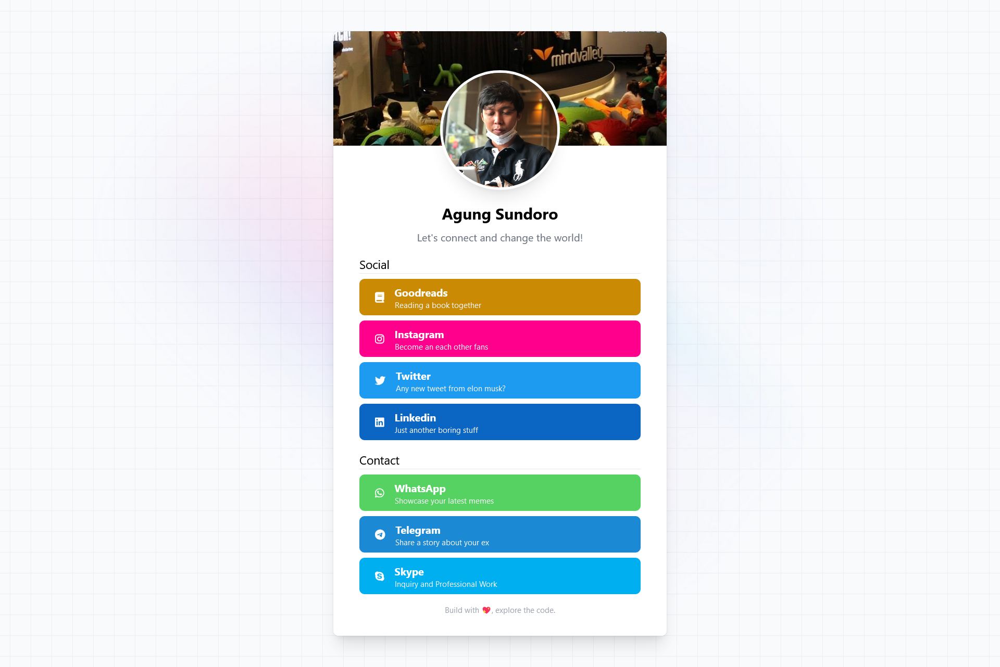

My GitHub profile page. You can change the configuration of the page by changing [config.json](config.json) file and run the install. 
See the [demo][website].


## 🤖 Installation

1. Prepare your `config.json` change the information according to your credentials.
2. Set `production` to `false` in `config.json`
3. Then run it : 

### via docker run 
```
docker run -d -p 80:80 \
  --name agung2001.github.io \
  -v /path/to/config.json:/usr/share/nginx/html/config.json \
  -v /path/to/avatar.jpg:/usr/share/nginx/html/assets/img/avatar.jpg \
  -v /path/to/cover.jpg:/usr/share/nginx/html/assets/img/cover.jpg \
  agung2001/agung2001.github.io:master
```
- NOTE: Don't forget to change the `/path/to/` accordingly

### via manual build 
- Install node package `npm i`
- Build asset `grunt build`
  - Watch `grunt watch`

## 📚 Notes

### Handle GitHub API Rate Limit
This repo uses GitHub public rest API to generate the graph network.
To buffer the data from the API please set `production` to `false` in `config.json`
Then store the object information into [nodes.json](nodes.json) & [edges.json](edges.json)

## 🔥 Development
Running the nginx server
- Rename `.env-sample` to `.env`
- Change `.env` according to your environment
- Docker `docker-compose up`

## ⚒️ Built with
- [Animate.style](https://animate.style/)
- [Fontawesome](https://fontawesome.com/)
- [Grunt JS](https://gruntjs.com/)
- [Svelte JS](https://svelte.dev/)
- [TailwindCSS](https://tailwindcss.com/)
- [Vis JS](https://visjs.org/)

## 📚 Resources
- [Official Repo](https://github.com/agung2001/agung2001.github.io)
- [GitHub REST API Docs](https://docs.github.com/en/rest)
- [Docker Hub](https://hub.docker.com/r/agung2001/agung2001.github.io)
- [GHCR](https://github.com/agung2001/agung2001.github.io/pkgs/container/agung2001.github.io) 

## ⭐️ Support
Help support me by giving a star or [donate][website]

[website]: https://agung2001.github.io