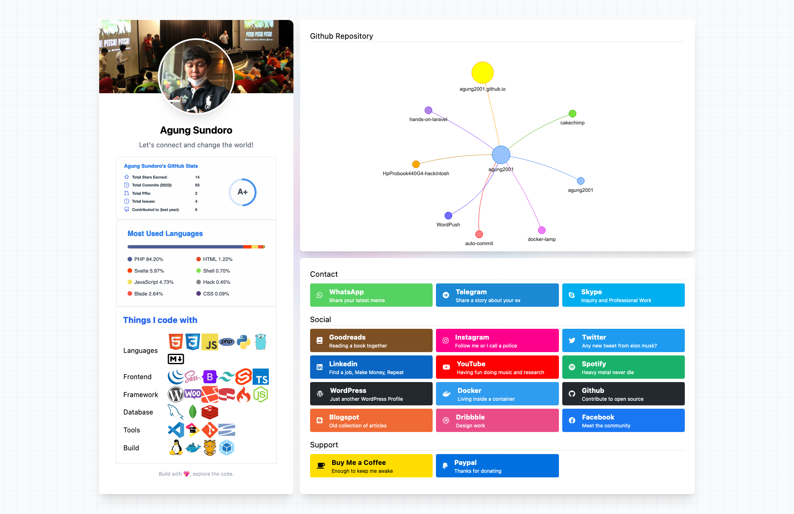

My GitHub profile page. See the [demo][website]

## 🤖 Installation
- Install node package `npm i`
- Build asset `grunt build`
  - Watch `grunt watch`

## 🔥 Development
- Rename `.env-sample` to `.env`, then change accordingly
- Docker `docker-compose up --build`

## ⚒️ Built with
- [Animate.style](https://animate.style/)
- [Fontawesome](https://fontawesome.com/)
- [Grunt JS](https://gruntjs.com/)
- [Svelte JS](https://svelte.dev/)
- [TailwindCSS](https://tailwindcss.com/)
- [Vis JS](https://visjs.org/)

## ⭐️ Support
Help support me by give a stars or [donate][website]

[website]: https://agung2001.github.io